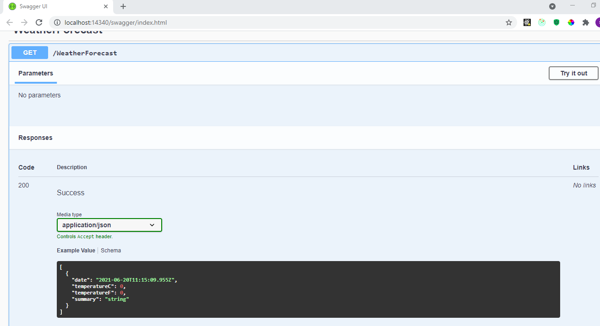
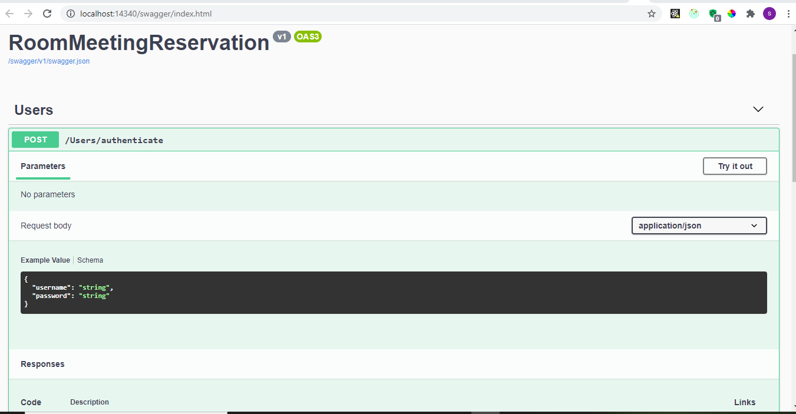
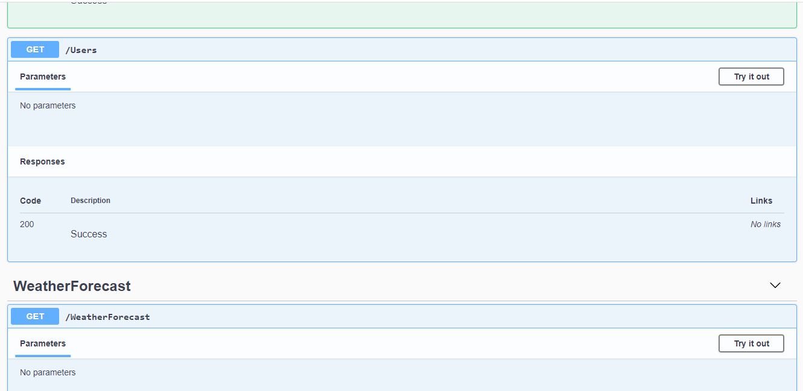
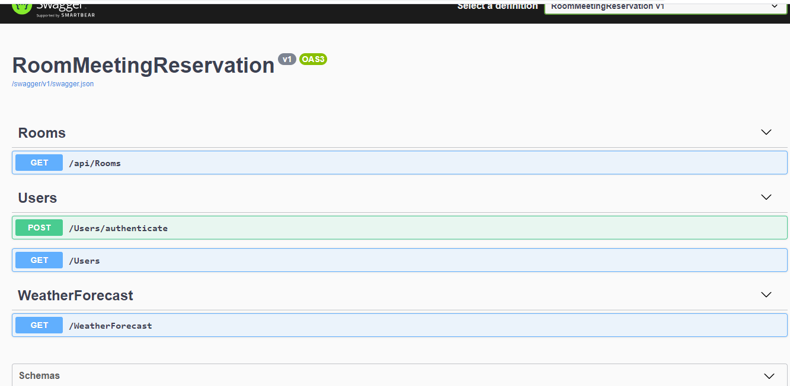
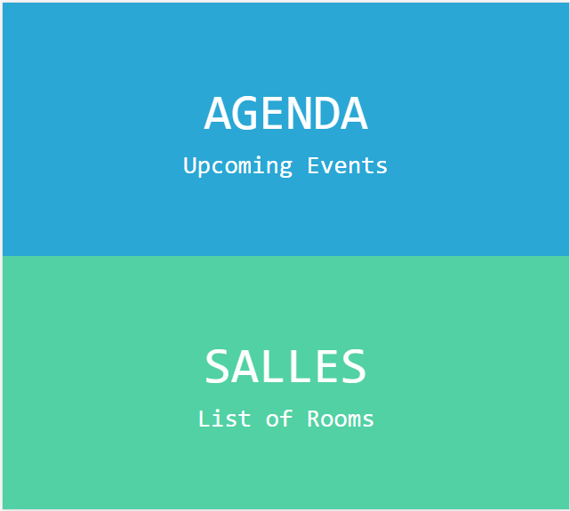
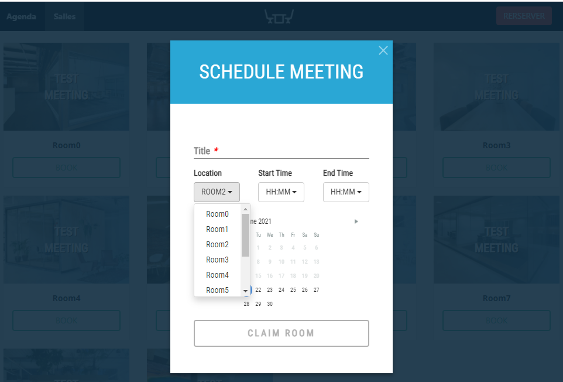
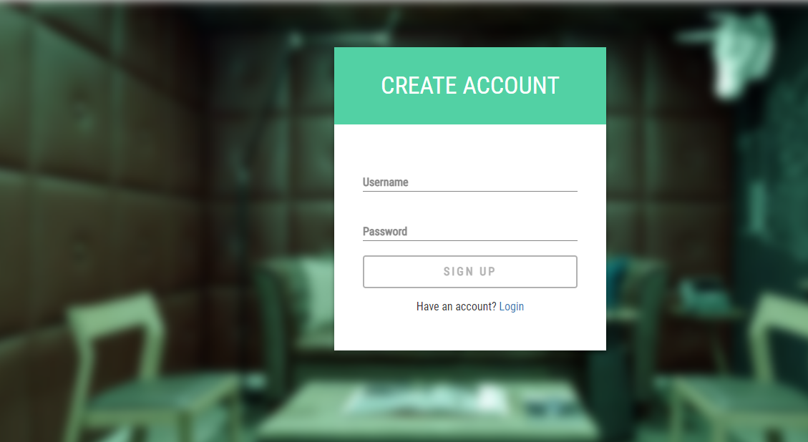

 # Room Reservation

### Content - :
  client folder(in react js)
  server folder (asp.core 5)

### How it work - :
  1- first start the server
    in the folder server\RoomMeetingReservation
	loucher the server (Déboger-Exécuter sans deboger)
  2- seconde client
    in the folder client\meeting-room-reservation
	loucher the client (yarn start)
	be sure the client point to the good port http://localhost:8000/

### when the app start - :
    when the app start you will be redirect to the loging page
	# Username:test
	# password: test
	
### After connected you see in the header  - :
    1 Agenda : for see all the all the booking in your agenda
    2 Salles : to see all the rooms (ten rooms) 
    2 Reserver : for make reservation 
	
### Made A Reservation:
    Onther the rooms clic the bouton (Resrver) to make reservation

### `Screen shot`
 
 
 
 
 
 
 
 
 
 
